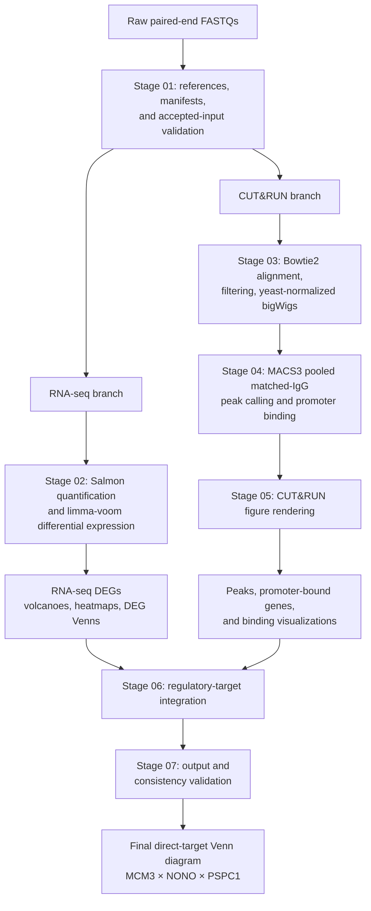

# MCM3-CUT&RUN-RNAseq

[](../../environment.yml)


[](https://doi.org/10.1038/s41592-000-0000-0)

**MCM3-CUT&RUN-RNAseq** is a reproducible multi-omics workflow for defining direct transcriptional targets of MCM3, NONO, and PSPC1 in mouse cells. It combines factor-specific CUT&RUN binding, matched-IgG controls, yeast spike-in normalization, and knockdown RNA-seq differential expression to distinguish promoter-bound, expression-responsive genes from indirect effects. The final analysis produces validated three-factor target overlaps and publication-ready figures.

> **DOI note:** The DOI badge is a manuscript placeholder and must be replaced with the registered DOI before publication.

## System requirements and installation

### Computing environment

| Component | Recommendation |
| --- | --- |
| Operating system | Linux (x86_64) or macOS. Apple Silicon users may require the documented `CONDA_SUBDIR=osx-64` compatibility setting. |
| CPU | 8 cores minimum; 16 cores recommended for parallel Bowtie2, Salmon, sort, and MACS3 workloads. |
| Memory | 32 GB RAM recommended for raw FASTQ reconstruction; 16 GB is suitable for analyses from accepted intermediates. |
| Storage | At least 100 GB free for raw reads, alignments, intermediate BAMs, and bigWigs. |
| Software | Conda or Mamba; all workflow executables are specified in `environment.yml`. |

### Installation

Run these commands from a parent directory of the repository.

1. Clone the repository.

   ```bash
   git clone <REPOSITORY_URL> MCM3-CUTRUN-RNAseq
   cd MCM3-CUTRUN-RNAseq
   ```

2. Create the dedicated Conda environment.

   ```bash
   CONDA_SUBDIR=osx-64 mamba env create -f environment.yml
   ```

3. Activate the workflow environment.

   ```bash
   conda activate mcm3-pipeline
   ```

The `mcm3-pipeline` environment is the single version-controlled computational specification for the workflow, so fully resolved package pins are essential for mathematical reproducibility. In the present repository, `environment.yml` contains `=VERSION` placeholders; replace each with a manuscript-verified version (and archive the resolved environment/lock file) before treating an installation as strictly pinned or using it for a final reproducibility claim.

## 🔬 Analysis Conditions & Parameters

The following conditions are implemented in the active workflow scripts and shared configuration. The RNA-seq workflow uses **limma-voom**, not DESeq2; `adj.P.Val` denotes the Benjamini–Hochberg-adjusted *P* value.

### RNA-seq quantification and testing

| Analysis component | Implemented condition |
| --- | --- |
| Quantification | Salmon transcript quantification against GENCODE M25; transcript-to-gene aggregation via `tx2gene.tsv` |
| MCM3 expression filter | CPM ≥1 in at least 2 selected samples |
| NONO/PSPC1 expression filter | Accepted cohort-level edgeR `filterByExpr` universe |
| Model | MCM3: limma-voom; NONO/PSPC1: limma-voom with quality weights |
| Differential-expression threshold | BH FDR (`adj.P.Val`) ≤0.05 and absolute log2 fold change ≥0.28 |
| Directional Venn assignment | Significant genes with `logFC > 0` (UP) or `logFC < 0` (DOWN) |

### CUT&RUN alignment, peak calling, and annotation

| Analysis component | Implemented condition |
| --- | --- |
| Mouse Bowtie2 alignment | `--local --very-sensitive-local --no-unal --no-mixed --no-discordant --phred33 -I 10 -X 700` |
| Yeast Bowtie2 alignment | `--very-sensitive -k 2 --no-unal --no-mixed --no-discordant --phred33 -I 10 -X 700` |
| BAM retention | Properly paired reads (`-f 3`), excluding secondary/QC-fail/duplicate/supplementary alignments (`-F 3840`), MAPQ ≥30 |
| Spike-in normalization | Mouse paired-fragment coverage scaled to 10,000 retained yeast read pairs; IGV display tracks multiply the mean signal by 10 |
| MACS3 candidate calls | Pooled two-replicate factor BAMPE against pooled matched IgG (`-f BAMPE -g mm --keep-dup all --call-summits -p 1e-3`) |
| MACS3 retained peaks | *P* ≤1e-4, *q* ≤0.01, and fold enrichment ≥3 |
| Background/control model | Matched pooled IgG is supplied to MACS3 with `-c`; no separate custom background model is configured |
| Promoter annotation | GENCODE M25 transcription-start-site window of ±1,000 bp |
| Overlap granularity | Atomic genomic segments and peak–promoter overlaps must each span ≥250 bp |
| Final binding call | Passing pooled matched-IgG peak plus factor/IgG promoter ratio ≥2 in both biological replicates (2/2) |

## Visual abstract



The accepted-intermediate route validates packaged RNA-seq and CUT&RUN artifacts in Stage 01, then uses Stage 04 to restage peak/promoter evidence. A raw reconstruction executes Stage 03 and calls Stage 04 with `--from-raw`.

## Quick start: reproducing the manuscript

The following tutorial gives the exact raw-CUT&RUN commands for Stages 03–07. First run Stages 01–02 to create the sample metadata and RNA-seq results required downstream:

```bash
python pipeline/bulkRNAseq/01_prepare_inputs.py --source raw --threads 16
python pipeline/bulkRNAseq/02_quantify_and_test.py --requantify --threads 16
```

### Stage 03 — align and normalize CUT&RUN

```bash
python "pipeline/CUT&RUN/04_align_and_normalize.py" --from-raw --threads 16
```

- **Input:** paired-end 20200923/20200929 CUT&RUN FASTQs listed in `cutrun_work/metadata/Samples.tsv`; mm10 and `sacCer3` Bowtie2 indices in `reference/`.
- **Processing:** Bowtie2 alignment to mouse and yeast genomes; duplicate marking/filtering; yeast-fragment scaling; replicate and mean bigWig generation.
- **Output:** sorted alignments under `cutrun_work/01_bowtie2/`, filtered indexed BAMs under `cutrun_work/02_bam/`, and normalized tracks plus `cutrun_work/03_bigwig/YeastNormalization.tsv`.

### Stage 04 — call peaks and define promoter binding

```bash
python "pipeline/CUT&RUN/05_call_peaks_and_define_binding.py" --from-raw
```

- **Input:** Stage 03 filtered factor and matched-IgG BAMs, normalized bigWigs, and `reference/gencode.vM25.annotation.gtf`.
- **Processing:** MACS3 pooled BAMPE calls against pooled IgG; peak filtering; promoter overlap; two-of-two replicate factor/IgG support.
- **Output:** MACS3 calls in `cutrun_work/04_peaks/`, promoter-bound gene tables in `cutrun_work/05_promoters/`, and canonical peak/promoter evidence in `cutrun_work/data/`.

### Stage 05 — render CUT&RUN figures

```bash
python "pipeline/CUT&RUN/06_render_figures.py"
```

- **Input:** Stage 03 bigWigs and Stage 04 peak/promoter tables, including `cutrun_work/data/Venn_Peaks_counts.tsv`.
- **Processing:** metaprofiles, RPKM displays, peak and promoter Venn diagrams, genomic distributions, and peak-profile panels.
- **Output:** publication figures in `cutrun_work/visuals/` and figure-ready intermediate tables in `cutrun_work/data/figure_inputs/`.

### Stage 06 — integrate binding with differential expression

```bash
python pipeline/regulatory_target/07_define_regulatory_targets.py
```

- **Input:** Stage 02 DEG tables, Stage 05 promoter-bound sets, and CUT&RUN tracks.
- **Processing:** factor-matched promoter-bound/DEG intersections, expression-direction classification, group assignment, and regulatory-target figure rendering.
- **Output:** direct-target tables, including `regulatory_work/data/Venn_target_{MCM3,NONO,PSPC1}_genes.tsv`, plus figures in `regulatory_work/visuals/`.

### Stage 07 — validate the final release

```bash
python pipeline/regulatory_target/07_validate_outputs.py
```

- **Input:** the registered figure inventory in `docs/output_manifest.tsv` and all Stage 02–06 data/figure outputs.
- **Processing:** existence, non-empty-file, DEG-count, CUT&RUN-count, promoter-region, and target-set consistency checks.
- **Output:** a terminal `[PASS]` result; Stage 07 is deliberately non-mutating and does not write a new data file.

For a packaged-intermediate reconstruction, use `--source accepted` in Stage 01, omit `--requantify` in Stage 02, omit both Stage 03 and `--from-raw` in Stage 04, then run Stages 05–07 unchanged. To execute the complete dependency graph in one command:

```bash
python pipeline/run_pipeline.py --source raw --step all --threads 16
```

## Expected outputs and visualizations

<details>
<summary>RNA-seq differential-expression figures</summary>

Stage 02 writes DEG tables to `deg_work/data/` and figures to `deg_work/visuals/`:

- `Volcano_MCM3.png`, `Volcano_NONO.png`, and `Volcano_PSPC1.png`
- `Heatmap_MCM3.png`, `Heatmap_NONO.png`, and `Heatmap_PSPC1.png`
- `VennDiagram_UP.png` / `VennDiagram_DOWN.png` and number-free counterparts

The DEG target-overlap inputs are preserved in `VennDiagram_{UP,DOWN}_data.tsv` and the factor-specific `VennDiagram_*_{MCM3,NONO,PSPC1}_genes.tsv` tables. A manuscript-specific RNA-seq direct-target overlap panel can be rendered from the Stage 06 `Venn_target_*_genes.tsv` tables.

</details>

<details>
<summary>CUT&amp;RUN binding figures</summary>

Stage 05 writes the peak-centric and promoter-centric visualizations to `cutrun_work/visuals/`. Principal outputs are `Venn_Peaks.png`, `Venn_PromoterGenes.png`, `Metaprofile_PromoterGenes.png`, `MCM3_RPKM.png`, `NONO_RPKM.png`, `PSPC1_RPKM.png`, and `Pie_PeakDistribution.png`.

Quantitative support is retained in `cutrun_work/data/Venn_Peaks_counts.tsv`, `Venn_Peaks_support.tsv`, `Venn_PromoterGenes_summary.tsv`, and `AnalysisParameters.tsv`.

</details>

<details>
<summary>Final regulatory-target overlap and run benchmarks</summary>

Stage 07 verifies the following promoter-bound gene-set baselines:

| Set | Expected genes |
| --- | ---: |
| MCM3 | 1,837 |
| PSPC1 | 3,494 |
| NONO | 490 |
| MCM3 ∩ NONO ∩ PSPC1 center | 354 |

The Stage 06 final direct-target overlap figure is validated by Stage 07:


Its source tables are `regulatory_work/data/Venn_target_MCM3_genes.tsv`, `regulatory_work/data/Venn_target_NONO_genes.tsv`, `regulatory_work/data/Venn_target_PSPC1_genes.tsv`, and `regulatory_work/data/Venn_target_shared_genes.tsv`.

</details>

## Repository structure

```text
MCM3-CUTRUN-RNAseq/
├── environment.yml                  # Conda software specification
├── reference/                        # GENCODE M25, mm10/sacCer3, Salmon/Bowtie2 indices
├── pipeline/
│   ├── bulkRNAseq/                   # Stages 01–02 and RNA-seq plotting helpers
│   ├── CUT&RUN/                      # Stages 03–05 and CUT&RUN plotting helpers
│   ├── regulatory_target/            # Stages 06–07 and integration helpers
│   └── run_pipeline.py               # Dependency-aware workflow launcher
├── deg_work/                         # Salmon quantifications, DEGs, RNA-seq figures
├── cutrun_work/                      # BAMs, bigWigs, peaks, promoter sets, CUT&RUN figures
├── regulatory_work/                  # Direct-target tables and integration figures
├── docs/
│   ├── output_manifest.tsv           # Registered final-figure inventory
│   └── generated_readme/             # Generated documentation
├── ../bulkRNAseq_data/               # Raw RNA-seq FASTQs (sibling directory)
└── ../CUT&RUN_data/                  # Raw CUT&RUN FASTQs (sibling directory)
```

## Citation

Update the placeholder metadata below with the accepted manuscript authors, title, venue, year, volume, pages, and DOI before citing the workflow.

> MCM3-CUT&RUN-RNAseq Consortium. (2026). *MCM3-CUT&RUN-RNAseq: Integrated CUT&RUN and knockdown RNA-seq analysis of MCM3, NONO, and PSPC1*. *Nature Methods*. https://doi.org/10.1038/s41592-000-0000-0

```bibtex
@article{mcm3_cutrun_rnaseq_2026,
  author  = {{MCM3-CUT&RUN-RNAseq Consortium}},
  title   = {MCM3-CUT&RUN-RNAseq: Integrated CUT&RUN and knockdown RNA-seq analysis of MCM3, NONO, and PSPC1},
  journal = {Nature Methods},
  year    = {2026},
  doi     = {10.1038/s41592-000-0000-0},
  note    = {Replace placeholder bibliographic metadata before publication}
}
```

## Issues and support

Please report reproducibility problems, installation failures, or analysis questions through the repository’s [GitHub Issues](../../issues) tab. Include the command used, the operating system, the resolved Conda package list, the relevant stage log, and a minimal error excerpt.
